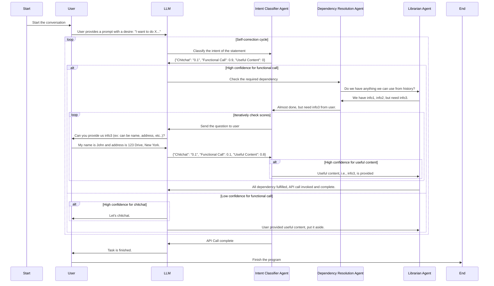

## System Diagram

```mermaid
sequenceDiagram
    participant S as Start
    participant U as User
    participant L as LLM
    participant A1 as Intent Classifier Agent
    participant A2 as Dependency Resolution Agent
    participant A3 as Librarian Agent
    participant ED as End

    S->>U: Start the conversation
    U->>L: User provides a prompt with a desire: "I want to do X..."
    loop Self-correction cycle
        L->>A1: Classify the intent of the statement
        A1->>L: {"Chitchat": "0.1", "Functional Call": 0.9, "Useful Content": 0}
        alt High confidence for functional call
            L->>A2: Check the required dependency
            A2->>A3: Do we have anything we can use from history?
            A3->>A2: We have info1, info2, but need info3.
            A2->>A1: Almost done, but need info3 from user.

            loop Iteratively check scores
                A1->>L: Send the question to user
                L->>U: Can you provide us info3 (ex: can be name, address, etc..)?
                U->>L: My name is John and address is 123 Drive, New York.
                L->>A1: {"Chitchat": "0.1", "Functional Call": 0.1, "Useful Content": 0.8}
                alt High confidence for useful content
                    A1->>A3: Useful content, i.e., info3, is provided
                end
            end

            A3->>L: All dependency fulfilled, API call invoked and complete.
        else Low confidence for functional call
            alt High confidence for chitchat
                L->>U: Let's chitchat.
            end
            L->>A3: User provided useful content, put it aside.
        end
    end

    A1->>L: API Call complete
    L->>U: Task is finished.
    U->>ED: Finish the program

```
